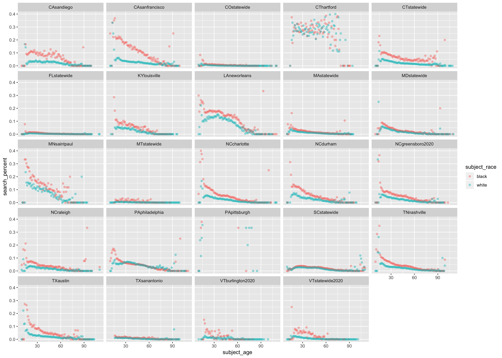

```{r, include=FALSE}
knitr::opts_chunk$set(echo = TRUE)
```

Here I plot the empirical search probabilities for each data set to see how the true search behavior compares with the predicted probabilities of our model. I use SQL commands COUNT and GROUP BY to circumvent downloading each data set individually; then, I use dplyr functions to calculate the search probability for each age and race group. (For race group, we only consider Black and white stopped motorists.)

First I load the necessary packages and establish the SQL connection, which isn't included here due to privacy. 

```{r load libraries", message = FALSE, eval=FALSE}

library(tidyverse)
library(RMySQL)
library(stringr)
library(geofacet)
library(grid) # for printing landscape plots

```

```{r, include = FALSE, eval=FALSE}

# Connect to SQL
con <- dbConnect(
  MySQL(), host = "traffic.st47s.com", user = "student", 
  password = "Sagehen47", dbname = "traffic")

```

### 1. Create a list of relevant data sets

Next, I use the function relevant_datasets to find the data set names that include all relevant variables: age, race, sex, date of stop, and whether or not a search was conducted. 

```{r, echo = FALSE, eval=FALSE}

relevant_datasets <- function(all_dataset_names, variables_of_interest){
  
  # create empty vector
  datasets_of_interest <- c()
    
  for(city in all_dataset_names){
    
    # cancenate SQL query string
    command <- paste("EXPLAIN", city, sep = " ")
    field_vector <- unlist(as.list(DBI::dbGetQuery(con, command))$Field, 
                           use.names = FALSE)
    # print(field_vector)
    
    # of_interest_book is TRUE iff field_vector contains all the variables of interest
    of_interest_bool <- setequal(intersect(field_vector, variables_of_interest),
                                 variables_of_interest)
    
    # add dataset name to vector if of_interest_bool
    if(of_interest_bool){
      datasets_of_interest <- c(datasets_of_interest, city)
    }
  }
  
  return(datasets_of_interest)
}

```

```{r datasets of interest code, eval=FALSE}

# query to find all data sets
all_dataset_names <- as.list(DBI::dbGetQuery(con, "SHOW TABLES"))$Tables_in_traffic

variables_of_interest <- c("subject_age", "subject_race", "subject_sex", "date", "search_conducted")

datasets_of_interest <- relevant_datasets(all_dataset_names, variables_of_interest)

# manually remove certain data sets
datasets_of_interest <- datasets_of_interest[-c(1, 8, 20, 26, 30)]

```

### 2. Query the stop and search counts.

Next, I use a function p_search_conducted to generate a list of data frames that has the probability that a search is conducted on a stopped motorist of a particular racial and age group. The input for this function is the name of a data set, and a data frame with search probabilities is returned.

More details of how this function works is as follows. First, it checks the variable type of search_conducted because our SQL database contains data sets with search_conducted values as character strings (so, type varchar) or as a binary 0 or 1, (so, type double). Second, the function queries SQL twice, counting the number of times a search was conducted for each racial-age group and the number of times a stop was conducted for each racial-age group. Since our logistic regression considers only stops on Black and white people, p_search_conducted will only consider racial groups Black and white. The former is the numerator of the eventual search probability while the latter is the denominator. Lastly, with some dplyr data manipulation, I combine the two data frames resulting from the two SQL queries to have one data frame of search probabilities. 

I use the lapply function to iterate p_search_conducted on a list of data set names (and return a list of data frames.)

```{r, eval=FALSE}

p_search_conducted <- function(dataset_name){

  dataset_str <- paste(dataset_name)
  
  # first, check the type of search_conducted
  explain_command_str <- paste("EXPLAIN", dataset_name, sep = " ")
  
  explain_df <- dbGetQuery(con, explain_command_str) %>%
    filter(Field == "search_conducted") %>%
    mutate(dataset = dataset_str) %>%
    select(Field, Type, dataset)
  
  # note that explain_df[1, 2] is the entry that has the type of search_conducted
  
  # second, create SQL search strings based on type of search_conducted
  if (explain_df[1, 2] == "varchar(50)") {
    
      search_numerator_sql <- paste("SELECT subject_age, subject_race, 
                                COUNT(*) as 'search_counts' FROM",
                                dataset_str, 
                                "WHERE (subject_race='black' 
                                OR subject_race = 'white') 
                                AND search_conducted = 'TRUE' 
                                AND subject_age > 0 
                                GROUP BY subject_age, subject_race", sep = " ")
    
  } else if (explain_df[1, 2] == "double") {
    
      search_numerator_sql <- paste("SELECT subject_age, subject_race, 
                                COUNT(*) as 'search_counts' FROM",
                                dataset_str, 
                                "WHERE (subject_race='black' 
                                OR subject_race = 'white') 
                                AND search_conducted = '1' 
                                AND subject_age > 0 
                                GROUP BY subject_age, subject_race", sep = " ")
      
  }
  
  stops_denominator_sql <- paste("SELECT subject_age, subject_race, 
                                 COUNT(*) as 'total_stop_counts' FROM", 
                                 dataset_str, 
                                 "WHERE (subject_race='black' 
                                 OR subject_race = 'white') 
                                 AND subject_age > 0 
                                 GROUP BY subject_age, subject_race", sep = " ")
  
  # third, calculate % search_conducted per age in df thru query
  
  search_numerator <- dbGetQuery(con, search_numerator_sql)
  
  stops_denominator <- dbGetQuery(con, stops_denominator_sql)
  
  # fourth, combine results into one df 
  
  search_probability <- search_numerator %>%
    right_join(stops_denominator, by = c("subject_race", "subject_age")) %>%
    replace_na(list(search_counts = 0)) %>%
    mutate(search_percent = search_counts / total_stop_counts,
           
           # create column for dataset name
           dataset = dataset_str,
           subject_age = as.numeric(subject_age))
  
  return(search_probability)

}

search_probs_list <- lapply(datasets_of_interest, p_search_conducted)

```

### 3. Combine and plot the data

Finally, I plot the data!

```{r, eval=FALSE}

combined_search_probs_list <- bind_rows(search_probs_list, .id = "column_label")

empirical_search_p <- combined_search_probs_list %>%
  ggplot() +
  geom_point(mapping = aes(x = subject_age, y = search_percent, color = subject_race), alpha = .4) +
  facet_wrap(~ dataset) +
  scale_y_continuous(limits = c(0, .4))

ggsave("empirical prob search_conducted.png", width = 14, height = 10, units = "in")

```

\newpage


```{r, echo=FALSE, out.extra='angle=90', out.width='11in', fig.width=10, fig.height=6, eval=FALSE}

empirical_search_p

```



\newpage
