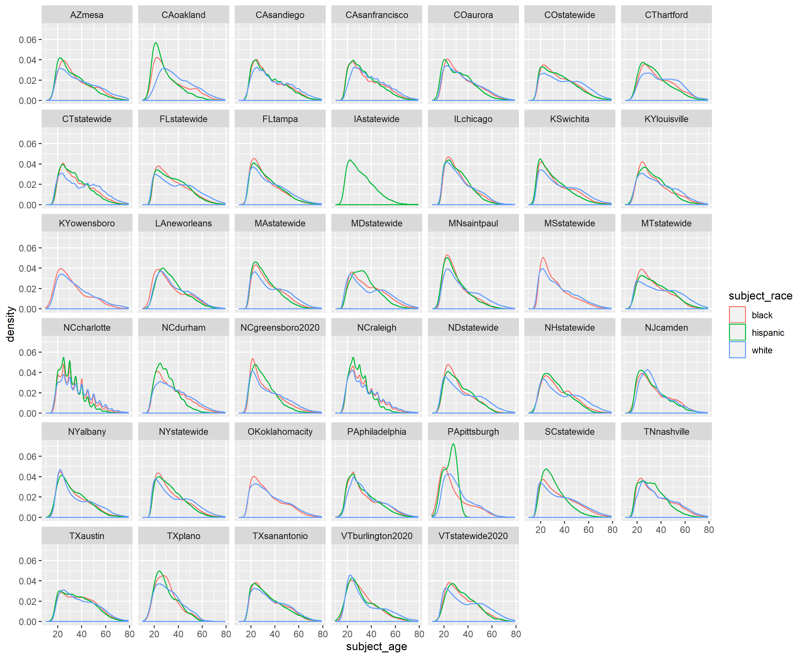

```{r include=FALSE}
knitr::opts_chunk$set(echo = TRUE)
```

We begin our exploratory data analysis by examining the recorded race, age, and sex of motorists involved in traffic stops. The goal of this section is to provide a high-level view of our 75 datasets. In particular, we see similarities and differences among states or cities. One trend is the consistently higher relative proportions of younger Black and Hispanic drivers than younger white drivers in their respective racial group. One notable variation is the police search rate: the white search rate in New Jersey is more than 75%, while the search rate for most other states and races is less than 25%. From these simple descriptive statistics, we pose further questions for the subsequent analyses of individual datasets in the next section.

A concurrent goal of this section is to sense the potential (and limitations) of working with our data. While querying one dataset to generate a dataset-level plot is feasible, I use SQL commands SELECT, COUNT, and GROUP BY to circumvent the memory problem posed by generating a national-level plot. Furthermore, the ubiquitous baseline problem (the lack of _traffic_ data to serve as a denominator for our _traffic stop_ data) crops up when interpreting these initial visualizations. Lastly, we gauge the comprehensiveness of our data. Missing data within individual datasets and missing variables within our datasets limit the size of our observations. Thus, this exercise provides a rough scope of what can and cannot be done with our data and foregrounds our remaining analyses. 
 
### Set Up

I first load the following packages. The package geofacet enables nationwide plots to be displayed in a map-like manner. I also connect to our SQL server, but that code is excluded here because of privacy. 

```{r "load libraries and oakland dataset", message = FALSE}

library(tidyverse)
library(RMySQL)
library(stringr)
library(ggplot2)
library(geofacet)

```

```{r, include = FALSE}

# Connect to SQL
con <- dbConnect(
  MySQL(), host = "traffic.st47s.com", user = "student", 
  password = "Sagehen47", dbname = "traffic")

```

I query the entire Oakland dataset. Before creating each nationwide visualization, I first use the Oakland dataset to create a local-level version. I include the intermediate Oakland visualizations in this section to illustrate the different methods of preparing city-level versus nation-level plots. Also, the intermediate plot adds some coherency to the interpretation and significance of the nationwide plot.

```{r}

CAoak <- DBI::dbGetQuery(con, "SELECT * FROM CAoakland")

```

### Race and sex of stopped motorists

This visualization will show the breakdown, by race and sex, of motorists who were stopped in a given dataset. I convert the counts of motorists in each demographic category to be in percentages, which conveys the relative size of each demographic group to the rest of the drivers stopped. (Crucially, this percentage does not compare the size of the demographic group to all drivers.)

The first version relays information from just one data set, Oakland, and the second version makes use of all data sets that record race and sex. Neither visualization conveys the extent of missing information; that is, I ignore the traffic stops in which race and/or sex are missing under the assumption that patrol officers fail to record data uniformly across motorists of different demographic groups.

#### Race and sex of stopped motorists in Oakland

For the Oakland visualization, I use dplyr functions to calculate the percent of stops in each racial group. Then, I plot the data in a bar chart.

```{r Oakland_race_and_sex_distribution}

CAoak %>%
  
  # remove missing data
  filter(!is.na(subject_sex) & !is.na(subject_race)) %>%
  
  # use group_by and summarize to count number of stops per category
  group_by(subject_sex, subject_race) %>%
  summarize(count = n()) %>%
  ungroup() %>%
  
  # find the percentage of age/race stops
  mutate(percentage = round(prop.table(count), digits = 2)) %>%
  
  # plot percentages
  ggplot(mapping = aes(x = subject_sex, y = percentage, fill = subject_race,
                       label = scales::percent(percentage))) +
  geom_bar(position = "dodge", stat = "identity") +
  
  # adjust labels
  geom_text(position = position_dodge(width = .9),    
            vjust = -0.5,   
            size = 3) + 
  scale_y_continuous(labels = scales::percent)

```

<!--  -->

We observe that within each racial group, the percentage of stopped males is double that for females. We cannot conclude, though, that a Black male driver is twice as likely than a Black female drive to be stopped.

Additionally, we cannot conclude anything about over- or under-representation of racial groups in the stop data. Although we can concretely point out that 7% of stopped drivers in Oakland are white males, we do not possess if that 7% should be higher or lower in the absence of discriminatory traffic patrol behavior.

#### Race and sex of stopped motorists, nationally

The national level plot contains information only for races white, Black, and Hispanic for greater ease of interpretation on the larger plot. To create a national version of the age race bar graph, I do the following:

#### 1. Create a list of relevant datasets

I use the function relevant_datasets to find the datasets that have variables subject_sex and subject_race. 

```{r, "load relevant_datasets function", include = FALSE, echo = FALSE}

relevant_datasets <- function(all_datasets, variables_of_interest){
  
  # initialize empty vector
  datasets_of_interest = c()
  
  for(city in all_datasets){
  
    # concatenate SQL EXPLAIN string 
    command <- paste("EXPLAIN", city, sep = " ")
    
    # query the variables of the dataset
    field_vector <- unlist(as.list(DBI::dbGetQuery(con, command))$Field, 
                             use.names = FALSE)
      
    # of_interest_book is TRUE iff field_vector contains all the variables of interest
    of_interest_bool <- setequal(intersect(field_vector, variables_of_interest), variables_of_interest)
      
    if(of_interest_bool){
      datasets_of_interest <- c(datasets_of_interest, city)
      }
  }
  
  return(datasets_of_interest)
}

```

```{r "STEP 1: generate relevant dataset list (national)", eval=FALSE}

# create list of all dataset names
all_dataset_names <-as.list(DBI::dbGetQuery(con, "SHOW TABLES"))$Tables_in_traffic

demographics_variables <- c("subject_race", "subject_sex")

race_sex_datasets <- relevant_datasets(all_dataset_names, demographics_variables)

```

#### 2. Query and clean  data

With the relevant data sets for the nationwide demographic visualization, I can run SQL queries on those data sets. I write the function query_count_RaceSex that takes as input a data set name and returns a cleaned dataframe with the percentage of each racial group calculated from a 50% random sample of each data set. 

```{r "STEP 2: query and clean data (demographics)",eval=FALSE}

query_count_RaceSex <- function(dataset_name){
  
  dataset_str = paste(dataset_name)

  # take a 50% random sample of each dataset for speed
  command <- paste("SELECT subject_race, subject_sex, COUNT(*) as 'stops' FROM", 
                   dataset_str,
                   "WHERE rand() <= .5 GROUP BY subject_race, subject_sex",
                   sep = " ")

  # query the data
  demographics_dataset <- dbGetQuery(con, command)
  
  if(dim(demographics_dataset)[1] < 1){
    
    # disregard empty dataset
    return(NULL)
    
  }
  
  # clean dataset a bit 
  demographics_dataset <- demographics_dataset %>%
  
    # use substr(), later on, to index into string and denote dataset 
    mutate(dataset = paste(dataset_str),
           
           # make subject_age to be type double
           stop_percent = prop.table(stops))

return(demographics_dataset)

}

```

Using base R's lapply function, I create a list of data frames with variables: race, sex, percent of stops, and data set name.

```{r,eval=FALSE}

race_sex_list <- lapply(race_sex_datasets, query_count_RaceSex)

```

#### 3. Combine and plot

I combine the list of data frames -- each row of this combined data frame has the percentage of motorists stopped in each demographic group. Next, I filter the data to include only demographic groups that are a combination of male and female with white, Black, and Hispanic. Through this, I also exclude percentage observations for which sex and/or race is not recorded. I limit my visualization to only include three races for ease of interpretation.

```{r "STEP 3: combine df's and plot (national)", message = FALSE, eval=FALSE}

# filter out missing data and certain races
race_sex_all <- bind_rows(race_sex_list, .id = "column_label") %>%
  
  filter(subject_sex == "female" | subject_sex == "male") %>%
  
  filter(subject_race == "white" | subject_race == "hispanic" | subject_race == "black")

# plot of race and sex distribution
race_sex_all %>%
  ggplot(mapping = aes(x = subject_sex, y = round(stop_percent, digits = 2), fill = subject_race, label = scales::percent(round(stop_percent, digits = 2)))) +
  geom_bar(position = "dodge", stat = "identity") + 
  
  # add annotations
  geom_text(position = position_dodge(width = .9),    
            vjust = -0.5,  
            size = 2) + 
  scale_y_continuous(labels = scales::percent) +
  facet_wrap(~ dataset) +
  ylab("percentage")

ggsave("race and sex distribution.png", width = 11, height = 9, units = "in")
```


\newpage
\blandscape

```{r, echo = FALSE, include=FALSE, eval=FALSE}

race_sex_all %>%
  ggplot(mapping = aes(x = subject_sex, y = round(stop_percent, digits = 2), fill = subject_race, label = scales::percent(round(stop_percent, digits = 2)))) +
  geom_bar(position = "dodge", stat = "identity") + 
  
  # add annotations
  geom_text(position = position_dodge(width = .9),    
            vjust = -0.5,  
            size = 2) + 
  scale_y_continuous(labels = scales::percent) +
  facet_wrap(~ dataset) +
  ylab("percentage")

```


\elandscape
\newpage

Observations:

* There are more male drivers stopped than female drivers stopped across near all racial groups and data sets. While the reason for this trend is outside the scope of this report, this trend informs our future analyses to consider disaggregating stop or search behavior by sex. Indeed, this is what Rosenfeld et al. do -- they examine search probabilities of only stops involving male drivers.

* There is no clear unifying trend of the racial distributions among the data sets. This reflects the range of  variables that determine racial breakdown of stopped drivers -- residential population, driving population, driving behavior, and traffic behavior are just a few. 

* This plot gives us a broader sense of how finding evidence of discrimination is difficult. We do not know what the racial percentage of traffic stops should be; without a comparison, we cannot conclude is a population is over- or under-represented. 

* Data collection is far from uniform. We observe that for data sets like MSstatewide and KYowensboro, there are no Hispanic drivers stopped; perhaps officers recorded motorists as "other." 

### Distribution of motorists' age by race

This next visualization shows the density of motorist ages, by race, who were stopped in a given data set. For ease of interpretation, I only plot age densities for motorists recorded as white, Black, and Hispanic. To calculate the kernel density of each age group, I use ggplot's geom_density function. Geom_density is a smoothed version of a histogram; the percentage of stopped drivers in a given racial group that is in a given age range is relayed by the area of the curve for that age range. 

As in the race and sex visualization, the percentages (or kernel estimates) for each age group do not relate drivers stopped at a certain age with all drivers in the area. Instead, the densities relate drivers stopped at a certain age with other drivers stopped. 

The first visualization relays information from just one data set, Oakland, and the second version makes use of all data sets that record subject age and race. Neither visualizations relay the extent of missing data, making use only of the observations that have age and race recorded. Also, I limit the range of subject ages to be less than 80.

#### Age distribution by race in Oakland

For the Oakland plot, I simply pipe the filtered Oakland data into ggplot. I let transparency, denoted by alpha, equal .5 to more easily discern trends in the graph.

```{r Oakland_racial_age_distribution}

CAoak %>%
  filter(subject_age < 80) %>%
  filter(subject_race != "other" & subject_race != "asian/pacific islander") %>%
  ggplot +
  geom_density(mapping = aes(x = subject_age, fill = subject_race, color = subject_race), alpha = .5)

```

Observations: 

* The densities of people of color (POC) drivers stopped is more skewed right than that for white drivers, with greater weights at younger ages. 

* The densities of POC drivers decline faster between ages 20-40 than that for white drivers. The relative weights of POC drivers age 30 and older is, in fact, lower than that for white drivers that age.

* A note on interpretation: again, the denominator of the kernel estimates is all other drivers who were stopped. This graph doesn't say that younger POC drivers are more likely to be stopped than younger white drivers. Rather, of the drivers stopped, younger POC drivers are represented more frequently than same-age white drivers. 

### Age distribution by race, nationally

The national level plot contains information only for races white, Black, and Hispanic and ages less than 80. To create a national version of this age density plot, I do the following:

#### 1. Create a list of relevant datasets

I use the function relevant_data sets to find the data sets that have variables subject_age and subject_race.

```{r "STEP 1: generate relevant datasets list (national)", eval=FALSE}

# all_dataset_names is a list of all data set names, already exists earlier in the code

age_variables <- c("subject_age", "subject_race")

age_datasets <- relevant_datasets(all_dataset_names, age_variables)

```

#### 2. Query and clean data

With the relevant data sets for plotting age distribution, I write a function query_clean_AgeRace. As input, the function takes a data set name and returns a 50% random subset of the data frame; I only query the age and race columns for efficiency and memory reasons. Thus, I also limit my subsetted data for races white, Black, and Hispanic and for motorists under the age of 80. (Originally, I planned to use the COUNT and GROUP BY commands in SQL but could not find a way for geom_density to take the number of stops as inputs.) 

```{r "irrelevant function that was a solid effort", include = FALSE, echo = FALSE, eval=FALSE}

# This function uses COUNT and GROUP BY for SQL which causes downstream problems for geom_density. So I decided to bruteforce SQL query all the data

count_age_by_race <- function(dataset_name){

  dataset_str = paste(dataset_name)

  # introduce cap of age 80 for motorists b/c querying big data leads to problems
  command <- paste("SELECT subject_age, subject_race, COUNT(*) as 'stop_counts' FROM",
                   dataset_str,
                   "WHERE (subject_race = 'black' OR subject_race = 'white' OR subject_race = 'hispanic') AND subject_age > 0 AND subject_age < 80 GROUP BY subject_age, subject_race LIMIT 275",
                   sep = " ")


  age_dataset <- dbGetQuery(con, command)

  if(dim(age_dataset)[1] < 1){
    return(NULL)
  }

  age_dataset <- age_dataset %>%

    # use substr(), later on, to index into string and denote dataset
    mutate(dataset = paste(dataset_str),

           # make subject_age to be type double
           subject_age = as.double(subject_age))

return(age_dataset)

}

count_age_list <- lapply(age_datasets, count_age_by_race)
```

```{r "STEP 2: query and clean data (age)", eval=FALSE}

query_clean_AgeRace <- function(dataset_name){
  
  dataset_str = paste(dataset_name)

  # introduce cap of age 80 for motorists b/c querying big data leads to problems
  # take a 50% sample of each dataset
  command <- paste("SELECT subject_age, subject_race FROM", 
                   dataset_str,
                   "WHERE (subject_race = 'black' OR subject_race = 'white' OR subject_race = 'hispanic') AND subject_age > 0 AND subject_age < 80 AND rand() <= .5",
                   sep = " ")


  age_dataset <- dbGetQuery(con, command)
  
  if(dim(age_dataset)[1] < 1){
    
    # disregard empty dataset
    return(NULL)
    
  }
  
  # clean dataset a bit 
  age_dataset <- age_dataset %>%
  
    # use substr(), later on, to index into string and denote dataset 
    mutate(dataset = paste(dataset_str),
           
           # make subject_age to be type double
           subject_age = as.double(subject_age))

return(age_dataset)

}
```

Using the lapply function, I create a list of data frames with variables: race, age, and data set name. Each row in these data frames contains information on one traffic stop from a data set. 

```{r,eval=FALSE}

age_race_list <- lapply(age_datasets, query_clean_AgeRace)

```

#### 3. Combine and make intermediate plot

I combine the list of data frames from the previous step. I also create an intermediate plot that does not use geofacet but simply facets by the data set, so city and statewide data sets are plotted separately.

```{r "STEP 3: combine data and plot intermediate (national)", message = FALSE, eval=FALSE}

age_race_all <- bind_rows(age_race_list, .id = "column_label")

# plot of racial age distributions per dataset

age_race_all %>%
  ggplot() +
  geom_density(aes(x = subject_age, color = subject_race), alpha = .3) +
  facet_wrap(~ dataset)

ggsave("racial age distribution without fill.png", width = 11, height = 9, units = "in")
```



\newpage
\blandscape

```{r, echo = FALSE, eval=FALSE, include=FALSE, eval=FALSE}
age_race_all %>%
  ggplot() +
  geom_density(aes(x = subject_age, color = subject_race), alpha = .3) +
  facet_wrap(~ dataset)
```

\elandscape
\newpage

Observations:

* For the current racial age distribution plot, the blue lines representing white drivers reach their maximum density level that is usually almost always less than the maximum densities of red and green lines, representing Black and Hispanic drivers. As in the Oakland-level plot, we thus see how across data sets, the densities of people of color drivers stopped is more skewed right than that for white drivers, with greater weights at younger ages. 

* The densities of POC drivers usually decline faster between ages 20-40 than that for white drivers. That is, the slope for POC drivers is usually steeper than for white drivers between those ages. The blue lines seem to peak around age 25 to 30 before decreasing, only to plateau at between ages 40 and 50. The relative weights of POC drivers age 30 and older is, in fact, lower than that for white drivers that age.

* By examining the data sets together, we can discern how the age densities of Oakland are not exactly replicated in other places. When we aggregate some data data sets to plot by state, some of the granularity among intra-state age distributions will be lost.

* Also, by examining the data sets together, we are reminded of uneven data collection. Iowa statewide (IAstatewide) only has a green line because subject_race is recorded most frequently as NA, then "other." I checked Iowa's data set and found that stops with race recorded as Hispanic make up less than 2.5% of the total stops recorded. Also, the spikes in the North Carolina data sets is probably indicative of patrol practices of estimating ages of stopped motorists.

* One possible future direction would be to plot the data into two separate plots, one for male and one for female. 

#### 4. Plot using geofacet

The next part of cleaning is extracting state name using stringr. By extracting the state abbreviation from the "dataset" variable, I can later pipe the data into geofacet to create a map-like plot.

```{r STEP 4: extract city/state names (national), eval=FALSE}

age_race_all <- age_race_all %>%
  
  # create state and city variables using substrings
  mutate(state = substr(dataset, start = 1, stop = 2),
         
         # city variable will be "statewide" if data set isn't city level
         city = ifelse(str_detect(dataset, "statewide"), state,
                      str_extract(substr(dataset, start = 3, stop = nchar(dataset)),
                                  "[a-z]+")))

```

```{r "STEP 5: lat/long scraper (don't run)", include = FALSE, run = FALSE}

# # i was playing around with/ tweaking Oliver's webscraper here. i realized that i didn't need it for the national visualization! this chunk requires packages XML and RCurl, which isn't loaded in this markdown.
# 
# # create df with distinct city names (or state names)
# city_df <- age_race_all %>%
#   
#   select(city) %>%
#   
#   distinct()
# 
# # scraper function for fetching coordinates from city
# get_coordinates <- function(city){
# 
#   # city is a string
#   
#   url_str <- paste("http://www.google.com/search?q=latitude+and+longitude+of+", 
#              city, sep = "")
#
#   doc <- htmlParse(getURL(url_str))
# 
#   # class = BNeawe iBp4i AP7Wnd retrieves the coordinates
#   coordinates <- xpathSApply(doc, "//div[@class='BNeawe iBp4i AP7Wnd']", xmlValue)[1]
#   
#   clean_coordinates <- str_split(coordinates, ", ")[[1]]
#   
#   # use regular expressions to extract lat and lng 
#   lat <- as.numeric(str_extract(clean_coordinates[1], "\\d+\\.*\\d*"))
#   # why multiple long by -1?
#   long <- -1*as.numeric(str_extract(clean_coordinates[2], "\\d+\\.*\\d*"))
# 
#   final_coordinates <- c(lat, long)
#   return(final_coordinates)
#   
# }
# 
# # fetch coordinates
# coordinate_list <- lapply(as.list(city_df$city), get_coordinates)
# 
# # create df with lat long AND city name together 
# coordinate_city_df <- data.table::transpose(data.frame(coordinate_list)) %>%
#   
#   rename(lat = V1, long = V2) %>%
#   
#   bind_cols(city_df)
# 
# # join coordinate_city_df with age_race_all df, key is city
# age_race_all <- age_race_all %>%
#   
#   left_join(coordinate_city_df, by = "city")

```

Because I extract the state abbreviation from the "dataset" variable, I can now pipe the data into ggplot, using geofacet to create a map-like plot.

```{r STEP 6: use geofacet to plot density (national), message = FALSE, eval=FALSE}

ggplot(data = age_race_all, aes(x = subject_age, color = subject_race)) +
  geom_density(alpha = .3) +
  facet_geo(~ state) +
  theme_bw()

ggsave("geofacet racial age distribution.png", width = 11, height = 9, units = "in")

```


\newpage
\blandscape


```{r, echo = FALSE, include=FALSE, eval=FALSE}

ggplot(data = age_race_all, aes(x = subject_age, color = subject_race)) +
  geom_density(alpha = .3) +
  facet_geo(~ state) +
  theme_bw()

```

\elandscape
\newpage

Observations:

* We do lose some granularity from the differences in patrol behavior per state, but the peaks and slope observations from the previous two plots still hold here. For brevity, I include them both here: the densities of people of color drivers stopped is more skewed right than that for white drivers, with greater weights at younger ages. Furthermore, the densities of POC drivers usually decline faster between ages 20-40 than that for white drivers. 

* By placing the plots in geographic relation to one another, the extent of uneven data collection becomes clearer. Only 45 out of our total 75 data sets have the two variables necessary to generate this plot. 

### Search rates

For this last nationwide visualization, we examine the search rates of different states, disaggregated by race. The search rate is calculated by taking the total number of searches and dividing by the total number of stops; it represents a conditional probability of being searched _given_ one is stopped. 

### 1. Query the data

We use the conveniently formatted datasets opp_stops_state and opp_stops_city. The two data sets have the following variables: search_rates, stops_rates, and subject_race for every state. 

```{r setup for search rates}

opp_stops_state <- DBI::dbGetQuery(con, "SELECT * FROM opp_stops_state")
opp_stops_city <- DBI::dbGetQuery(con, "SELECT * FROM opp_stops_city")

```

### 2. Transform data

We then combine certain observations from the two data sets to maximize our state coverage. Next, to find the average stop rate per racial group and state, I use tidyverse functions group_by (by race and state) and summarise; then, I average the stop rates. 

As I am taking the simple average, this average stop rate does not reflect the different number of stops per data set in a given state. For example, in a given state, say that there are two police departments, one that conducts 1 million stops total and one that conducts 1,000 stops total. In my average search rate, the search rates of both these hypothetical police department is weighted equally. 

```{r, eval=TRUE}

# retrieve additional states from the opp_stops_city dataset
opp_stops_state <- rbind(opp_stops_state, opp_stops_city %>% 
                           filter(state=="NJ" | state=="OK" | state=="PA" | state=="KS" | state=="KY" |  state=="LA" | state=="MN")) %>%
  
  # We only want to look at states, race, and stop_rate; this could be 
  # modified to display other variables
  select("state", "subject_race", "stop_rate") %>%
  
  # find average stop rate per racial group per state
  group_by(subject_race, state) %>%
  summarise(stop_rate = mean(stop_rate))

```

### 3. Plot using geofacet

The first nationwide plot is a bar chart, faceted by states.

```{r, echo = FALSE, eval=FALSE}

# visualize with geo_facet
stop_rate_p <- ggplot(opp_stops_state, aes(x = subject_race, y = stop_rate, fill = subject_race)) +
  geom_col() +
  theme_bw() +
  facet_geo(~ state) +
  theme(axis.text.x = element_text(angle=45))

ggsave("geofacet_stop_rates.png", width = 11, height = 8, units = "in")

```

```{r, eval=FALSE, echo=FALSE, out.extra='angle=90', out.width='11in', fig.width=10, fig.height=7}
stop_rate_p
```


\elandscape
\newpage

observations:

* The main takeaway from this bar plot is that the search propensity of police departments (aggregated into states) varies widely. States like New Jersey, Pennsylvania, and Montana are the only states with search rates for a racial group that reach 25%.

* The majority of states have average search rates under 25%; for these states, this chart is not particularly useful for seeing trends because of axis scaling.

* Presented with these search rates, we are again confronted with the difficulty of proving discrimination. Looking at search rates by race alone does not provide convincing evidence of or against racial profiling.

### 4. Use scatter plot to examine ratios

The second nationwide plot makes use of scatter plots and relays the ratio of search rates between Black and white and Hispanic and white search rates. I use color coding for the ratio of the search rate for a POC group to the corresponding white search rate. 

Each dot in the following graphs represents one state. I include a y = x line to indicate where the ratios would be, if they were equal.

```{r}

opp_stops_state %>%
  ungroup(subject_race) %>%
  spread(key = subject_race, value = stop_rate) %>%
  ggplot(aes(x = white, y = black, color = black/white)) +
  geom_point() +
  geom_abline(slope=1, intercept=0) +
  xlab("white search rate") +
  ylab("Black search rate") + 
  scale_colour_gradient(low = "#56B1F7", high = "#FA5858", limits = c(0, 3.5))

opp_stops_state %>%
  ungroup(subject_race) %>%
  spread(key = subject_race, value = stop_rate) %>%
  ggplot(aes(x = white, y = hispanic, color = hispanic/white)) +
  geom_point() +
  geom_abline(slope=1, intercept=0) +
  xlab("white search rate") +
  ylab("Hispanic search rate") + 
  scale_colour_gradient(low = "#56B1F7", high = "#FA5858", limits = c(0, 3.5))

```

Observations:

* The recorded Black-white search rate per state is generally greater than one, while the recorded Hispanic-white search rate is generally less than one. Reasons for these discrepancies range from poor data collection to discrimination, but which factors are driving this difference is far outside the scope of this plot.
